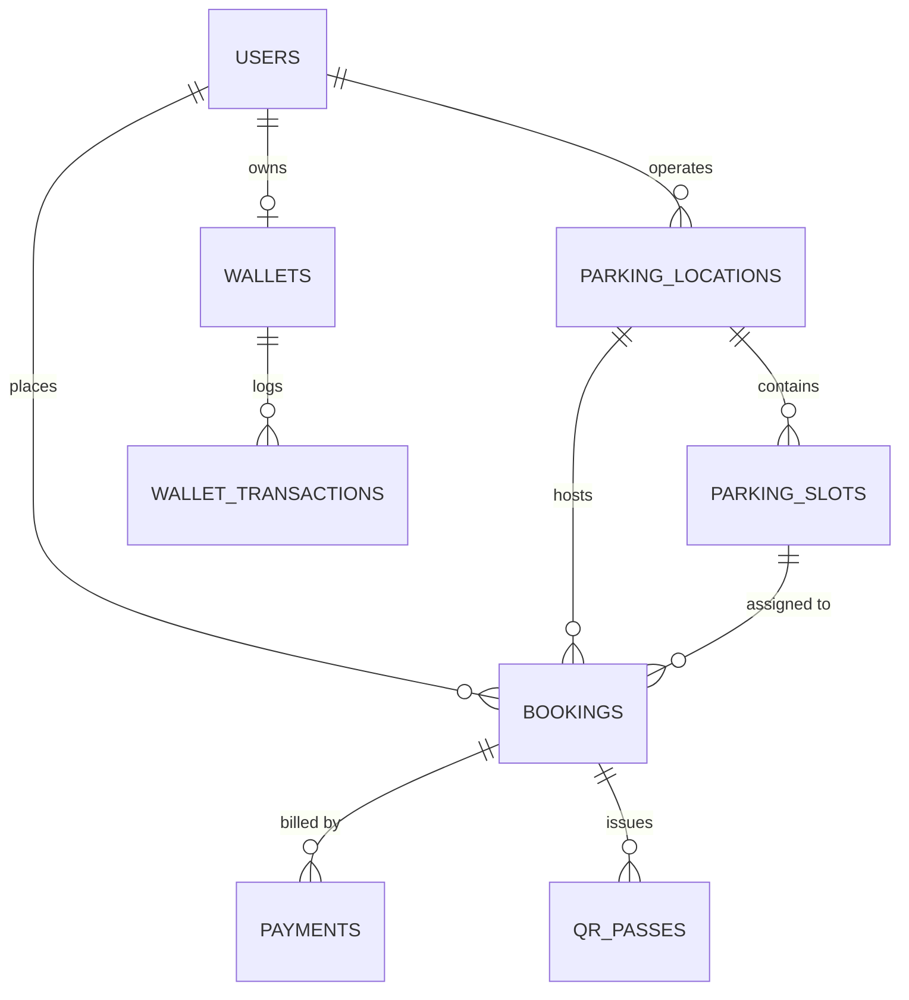

# ParkEase PostgreSQL Database Schema Specification

This document provides the Entity-Relationship (ER) model and table definitions for ParkEase.

---

## 1. Entity-Relationship Summary

---

## 2. Table Catalog

### `users`
- `id` (VARCHAR(36), PK)
- `email` (VARCHAR(255), UNIQUE, INDEX)
- `hashed_password` (VARCHAR(255))
- `full_name` (VARCHAR(150))
- `phone_number` (VARCHAR(20))
- `role` (ENUM: `DRIVER`, `PARKING_OWNER`, `STAFF`, `ADMIN`)
- `is_active` (BOOLEAN)
- `created_at`, `updated_at` (TIMESTAMP WITH TIMEZONE)

### `parking_locations`
- `id` (VARCHAR(36), PK)
- `name` (VARCHAR(200))
- `address` (VARCHAR(300))
- `city` (VARCHAR(100), INDEX)
- `latitude` (FLOAT), `longitude` (FLOAT)
- `total_slots` (INT), `available_slots` (INT)
- `hourly_rate` (FLOAT)
- `owner_id` (VARCHAR(36), FK -> `users.id`)
- `is_open` (BOOLEAN)

### `parking_slots`
- `id` (VARCHAR(36), PK)
- `location_id` (VARCHAR(36), FK -> `parking_locations.id`)
- `slot_number` (VARCHAR(50))
- `floor_level` (VARCHAR(20))
- `is_ev_charging` (BOOLEAN)
- `status` (ENUM: `AVAILABLE`, `RESERVED`, `OCCUPIED`, `MAINTENANCE`)

### `bookings`
- `id` (VARCHAR(36), PK)
- `user_id` (VARCHAR(36), FK -> `users.id`)
- `location_id` (VARCHAR(36), FK -> `parking_locations.id`)
- `slot_id` (VARCHAR(36), FK -> `parking_slots.id`)
- `vehicle_number` (VARCHAR(30))
- `start_time`, `end_time` (TIMESTAMP WITH TIMEZONE)
- `total_hours` (FLOAT), `total_amount` (FLOAT)
- `status` (ENUM: `PENDING`, `CONFIRMED`, `ACTIVE`, `COMPLETED`, `CANCELLED`, `EXPIRED`)
- `actual_entry_time`, `actual_exit_time` (TIMESTAMP WITH TIMEZONE)
- `overstay_charges` (FLOAT)

### `wallets` & `wallet_transactions`
- `wallets`: `id`, `user_id` (FK, UNIQUE), `balance` (FLOAT), `currency` (VARCHAR(10))
- `wallet_transactions`: `id`, `wallet_id` (FK), `amount` (FLOAT), `type` (`TOPUP`, `BOOKING_PAYMENT`, `REFUND`, `OVERSTAY_CHARGE`), `description`

### `qr_passes`
- `id` (VARCHAR(36), PK)
- `booking_id` (VARCHAR(36), FK -> `bookings.id`)
- `type` (ENUM: `ENTRY`, `EXIT`)
- `qr_payload` (VARCHAR(500)), `hash_signature` (VARCHAR(255))
- `valid_from`, `valid_until` (TIMESTAMP WITH TIMEZONE)
- `is_used` (BOOLEAN), `used_at` (TIMESTAMP WITH TIMEZONE)
